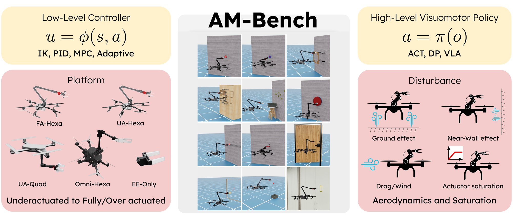

<p align="center">
  
</p>

# AM-Bench

**A modular simulation suite and benchmark for aerial manipulation policy learning.**

[](https://arxiv.org/abs/2609.00641)
[](https://docs.isaacsim.omniverse.nvidia.com/latest/index.html)
[](https://docs.python.org/3/whatsnew/3.11.html)
[](https://releases.ubuntu.com/22.04/)
[](https://opensource.org/license/apache-2-0)
[](https://pre-commit.com/)

[**[Project page]**](https://ambench.github.io/) &ensp; [**[Documentation]**](https://ambench.github.io/docs/) &ensp; [**[Paper]**](https://arxiv.org/abs/2609.00641)

Standardized benchmarks have driven robot manipulation learning, but they overwhelmingly
assume a fixed, ground-supported base. Aerial manipulation breaks that assumption: the
arm moves the base it is mounted on, thrust is limited, and aerodynamics couple the two.
AM-Bench is an [Isaac Lab](https://developer.nvidia.com/isaac-lab) suite for studying how
embodiment, control, disturbances, and policy choice interact in that regime.

## Key Features

- **Embodiments spanning actuation regimes** — underactuated (`UAQuad`, `UAHexa`), fully
  actuated (`FAHexa`), and overactuated (`OmniHexa`), plus an `EE` floating end-effector
  oracle for isolating task logic from flight dynamics.
- **12 tasks across three interaction classes** — instantaneous contact, object transport,
  and articulated or constrained contact.
- **Standard low-level controllers** — 4-DoF and 6-DoF PID, L1 adaptive, and whole-body
  MPC, with Pyroki inverse kinematics.
- **Configurable disturbances** — aerodynamic drag, ground effect, near-wall effect, and
  rotor actuator saturation, all switchable per environment.
- **Policy-learning baselines** — ACT, Diffusion Policy, and OpenPI (π₀ / π₀.₅), sharing
  one canonical LeRobot dataset format, plus scripted experts for every task.
- **One action interface** — absolute end-effector pose, or absolute base pose and arm
  joints when a policy should command the whole body directly.

## Installation

A native Linux host (Ubuntu 22.04 or 24.04), a discrete NVIDIA GPU, and Isaac Sim 5.1 with
Python 3.11 are required. WSL and Docker are not maintained paths.

Once Isaac Sim and Isaac Lab are installed:

```bash
git clone --recurse-submodules https://github.com/ambench/ambench.git
cd ambench
source ../IsaacLab/env_isaaclab/bin/activate
uv pip install -e source/ambench
uv pip install -e source/ambench_learn
python scripts/environments/list_envs.py
```

See [Installation](https://ambench.github.io/docs/getting-started/installation/) for the
full procedure, including the optional Pyroki (IK) and acados (MPC) components, then
[Verify Installation](https://ambench.github.io/docs/getting-started/first-run/).

## Quick Start

Step an environment with zero actions to confirm the scene loads:

```bash
python scripts/environments/zero_agent.py \
  --task PressButton-Am-EE-Abs-PID-Direct-v0 \
  --num_envs 1 --headless --device cuda:0
```

Record demonstrations from the scripted expert:

```bash
python scripts/data/record_demos_scripted.py \
  --task PressButton-Am-FAHexa-Abs-PID-Direct-v0 \
  --dataset_root <dataset-root> \
  --state_keys ee_pos ee_quat gripper_width \
  --task_prompt "press the button" \
  --num_demos 10
```

Evaluate a trained policy:

```bash
python -m ambench_learn.policies.act.eval \
  --task PressButton-Am-FAHexa-Abs-PID-Direct-v0 \
  --checkpoint <act-checkpoint> \
  --num-rollouts 10 --num-envs 1 --seed 0 \
  --output-dir <evaluation-root>/act
```


## Documentation

[ambench.github.io/docs](https://ambench.github.io/docs/) covers installation, the
environment registry, configuration, demonstration collection, policy evaluation, and
extension guides. The source lives in the [ambench.github.io](https://github.com/ambench/ambench.github.io) repository under `docs/`; send documentation changes there.

Contributing: start from [Extend an Existing Environment](https://ambench.github.io/docs/extend/)
for the task, robot, controller, and policy guides, and
[Development Setup](https://ambench.github.io/docs/extend/development/) for editor
configuration, formatting, building the docs, and simulator performance tuning.
`AGENTS.md` and `CODING_STYLE.md` describe the repository conventions.

## Citation

If you use AM-Bench in your research, please cite:

```bibtex
@inproceedings{wang2026ambench,
  title     = {{AM-Bench}: A Modular Simulation Suite and Benchmark for Aerial Manipulation Policy Learning},
  author    = {Wang, Yutong and Lee, Dongjae and Guo, Xiaofeng and Zhan, Yuanzhu
               and Jiang, Yufei and Saravanan, Bavin and Cao, Muqing and Xie, Jia
               and Mao, Chenyang and Scherer, Sebastian and Geng, Junyi and Shi, Guanya},
  booktitle = {Conference on Robot Learning (CoRL)},
  year      = {2026},
  eprint    = {2609.00641},
  archivePrefix = {arXiv},
  primaryClass  = {cs.RO},
  url       = {https://arxiv.org/abs/2609.00641}
}
```

Machine-readable metadata is in [`CITATION.cff`](CITATION.cff).

## License

AM-Bench is released under the [Apache License 2.0](LICENSE).

This repository redistributes third-party components under their own licenses, including
the Universal Manipulation Interface / Diffusion Policy source tree (MIT, Columbia
Artificial Intelligence and Robotics Lab) and several files derived from Isaac Lab
(BSD-3-Clause). See [`THIRD_PARTY_NOTICES.md`](THIRD_PARTY_NOTICES.md) for the complete
list.
